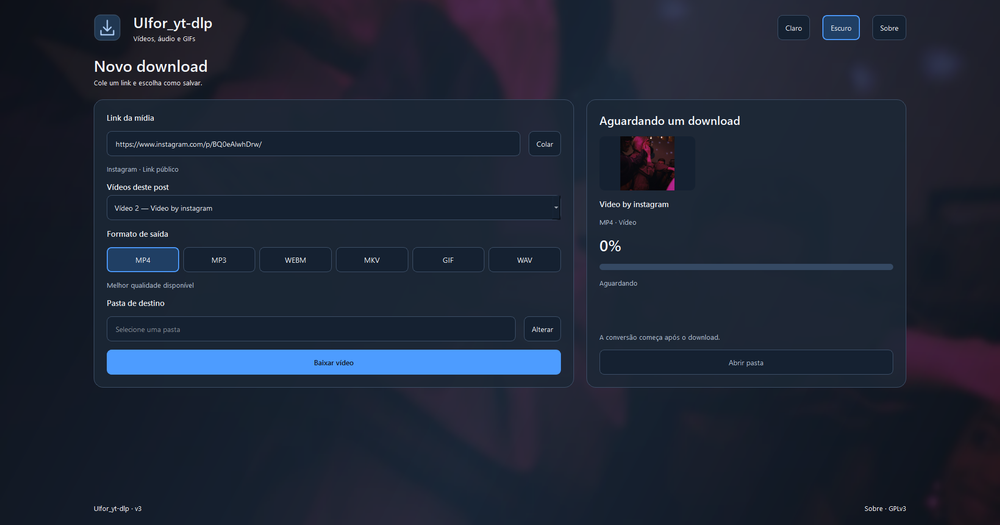
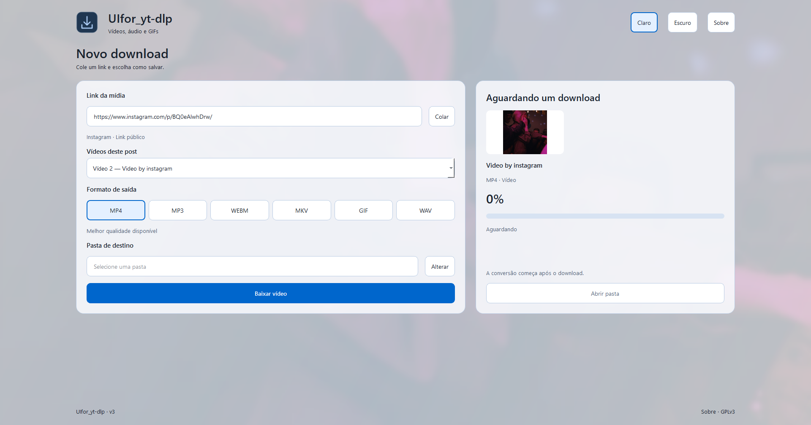

# UIfor_yt-dlp · V3.3

[English](README.en.md) · [Fontes e limites](docs/SOURCES.md) · [Build e distribuição](docs/BUILD.md) · [Validação](docs/VALIDATION.md)

Interface gráfica para baixar e converter mídia sem precisar usar o terminal. O aplicativo usa **yt-dlp** para extração/download e **FFmpeg** para conversão; não é uma distribuição oficial nem modifica o código dessas bibliotecas.

## O que há de novo na V3.3

Esta versão reúne a renovação visual e a expansão de fontes sobre a primeira base pública v3:

- **Cinco novas fontes:** Instagram, X/Twitter, Facebook, Twitch e TikTok experimental, além do YouTube. O aplicativo passa a servir para vídeos, áudio e GIFs de diferentes sites.
- **Nova interface em Windows, Linux e Android:** temas Claro/Escuro com preferência salva, controles de formato visíveis, painel de mídia/progresso e layout adaptado a janelas menores. O desktop maximiza normalmente, preservando a barra de tarefas e os painéis do sistema.
- **Prévia antes de baixar:** ao colar um link, o app tenta mostrar título e thumbnail original automaticamente. Essa consulta não transfere a mídia; se falhar, não mostra erro nem impede tentar o download.
- **Fundo com a thumbnail:** a imagem da mídia aparece desfocada sob uma camada azul no escuro ou perolada no claro, com painéis translúcidos e controles nítidos.
- **Capa dentro dos arquivos MP4/MKV:** quando disponível, a thumbnail original é incorporada sem reencodar o vídeo/áudio e sem deixar uma imagem separada.
- **Escolha em posts com vários vídeos:** baixar um vídeo específico ou todos; Todos começa selecionado. Arquivos recebem ID/índice para evitar colisões e resultados concluídos são preservados em falhas parciais.
- **WEBM em fontes sem streams WebM:** conversão para VP9/Opus quando necessária, mantendo MP4, MP3, MKV, GIF e WAV.

O mantenedor confirmou que o teste do aplicativo **funcionou no celular**. A [validação](docs/VALIDATION.md) diferencia esse relato dos testes automatizados e das verificações ainda pendentes.

## Fontes integradas

**Fontes integradas: YouTube, Instagram, X/Twitter, Facebook, Twitch e TikTok (experimental).** Esta expansão aceita links públicos individuais; as playlists existentes do YouTube continuam disponíveis.

| Fonte | Conteúdo desta etapa |
| --- | --- |
| YouTube | Vídeos, Shorts e playlists existentes |
| Instagram | Reels e posts com vídeos |
| X/Twitter | Posts com vídeos |
| Facebook | Vídeos, reels e posts públicos com vídeo |
| Twitch | Clips e vídeos gravados |
| TikTok | Vídeos individuais — experimental |

Downloads de amostras Instagram/X/Facebook/Twitch passaram no Windows. O teste manual em Android foi confirmado pelo mantenedor; não foi fornecida uma lista dos sites/formatos testados. TikTok continua experimental após falhas nas amostras, e Twitch VOD, Linux desta revisão e CI remoto ainda têm validações pendentes. Consulte [Fontes e limites](docs/SOURCES.md) e [Validação](docs/VALIDATION.md).

Links curtos reconhecidos, como `vm.tiktok.com`, `vt.tiktok.com`, `t.co` e `fb.watch`, são resolvidos quando apontam para um tipo de mídia aceito. Nas novas fontes, perfis completos, stories, coleções e transmissões ao vivo ficam fora desta etapa. Não se promete baixar qualquer conteúdo desses serviços; login, remoção, região ou mudanças no site podem impedir o acesso.

## Como a IA participa

O projeto começou sem inteligência artificial e era fechado. A IA passou a produzir sua evolução inicialmente como um experimento de capacidade de modelos, principalmente da OpenAI, e depois se tornou a principal forma de desenvolvimento e manutenção. A interface e as integrações de download são produzidas de maneira amplamente autônoma, com orientação humana e pouca edição direta do código. A primeira versão disponibilizada publicamente é a **v3**.

Essa declaração se refere ao código deste aplicativo. Não atribuímos uso de IA ao yt-dlp, ao FFmpeg ou às demais dependências sem uma declaração explícita delas. Não há modelo de IA executando os downloads ou as conversões: essas operações são realizadas pelas bibliotecas e ferramentas mencionadas. Produção por IA não é uma declaração de que todo o código foi revisado manualmente; as verificações realizadas e suas limitações estão registradas em [Validação](docs/VALIDATION.md).

## Interface e funcionalidades





Capturas reais da interface no Windows, feitas antes do ajuste do número exibido para V3.3.

Os temas **Claro / Escuro** mudam dentro do app e ficam salvos para a próxima abertura. A troca preserva campos, miniatura e operação em andamento. Ao digitar ou colar um link de vídeo completo, o app busca automaticamente título e thumbnail após uma pausa de 450 ms, sem iniciar download. YouTube usa o oEmbed público; as novas fontes usam metadados do yt-dlp em processo separado. Sem cookies pessoais na prévia, sem transferir mídia e com prazo automático de 12 segundos. Se ela falhar, o painel mantém o espaço reservado e não mostra erro; o download normal continua disponível e busca seus próprios dados ao ser iniciado. Respostas de links anteriores são descartadas.

Quando a thumbnail carrega, ela também preenche o fundo, com recorte central proporcional, desfoque suave e uma camada azul no escuro ou perolada no claro. Os painéis ficam translúcidos; campos, botões e miniatura permanecem nítidos. O fundo aparece em uma transição de 250 ms, fica fixo ao rolar e se adapta ao tamanho da janela. Editar/apagar o link limpa a imagem imediatamente. Sem thumbnail ou se o efeito falhar, o gradiente e os painéis opacos continuam funcionando, sem aviso de erro. O efeito reutiliza a imagem já obtida, sem consulta adicional ou alteração do arquivo baixado.

No YouTube, a prévia reconhece links `watch`, `youtu.be`, Shorts, live e embed. Listas sem um vídeo identificado e vídeos privados/restritos podem não apresentar prévia; isso não determina se o download será possível. Durante downloads e playlists, o painel acompanha os dados da mídia atual; uma falha de imagem mantém o ícone genérico e o download continua.

Nos novos downloads MP4/MKV, a capa é gravada dentro do arquivo, sem reencodar o vídeo ou o áudio e sem deixar uma imagem separada. A thumbnail é convertida para JPEG quando necessário. Sem imagem disponível, o vídeo continua sendo salvo. WEBM e GIF mantêm sua prévia normal; a exibição da capa incorporada depende do gerenciador de arquivos/player e de seu cache. Arquivos baixados anteriormente não são alterados automaticamente. A incorporação usa os [pós-processadores oficiais do yt-dlp](https://github.com/yt-dlp/yt-dlp/blob/2026.08.19/yt_dlp/postprocessor/embedthumbnail.py).

| Formato | Comportamento |
| --- | --- |
| MP4 / MKV | Melhor vídeo e áudio disponíveis, com merge/remux e thumbnail original incorporada como capa quando disponível; codecs dependem da fonte. |
| MP3 | Extração de áudio com qualidade configurada em 192 kb/s. |
| WAV | Extração de áudio. |
| WEBM | Prefere streams WEBM e converte para VP9/Opus quando necessário; a conversão pode demorar mais. |
| GIF | Trecho de até 30 segundos, 15 fps, largura máxima de 720 pixels, sem áudio. |

Posts com vários vídeos mostram um seletor: **Todos os vídeos** começa selecionado, com opções para cada vídeo. A capa acompanha a seleção. Se a lista surgir só após clicar em Baixar, escolha e clique novamente. Os nomes incluem ID/índice para evitar colisões; downloads parciais preservam os arquivos concluídos.

Há seleção de playlist YouTube, progresso, indicação de pós-processamento e acesso ao resultado. Windows e Linux usam PySide6: primeira abertura maximizada, barra de título nativa, barra de tarefas/painéis preservados e tamanho/estado restaurados nas próximas aberturas. A janela pode ser redimensionada; em largura menor, os painéis são empilhados com rolagem vertical. Não há modo de tela cheia imersiva.

O Android usa a mesma direção visual, com coluna única, formatos visíveis, temas persistentes e controles de toque. Os arquivos finais continuam em `Downloads/BaixarMusicaYouTube` pelo MediaStore; o botão final abre o último arquivo quando houver aplicativo compatível. Identidade, assinatura e caminhos existentes foram preservados. As capturas acima são do desktop; o funcionamento no celular foi relatado pelo mantenedor.

## Como usar

1. Cole o endereço da página da mídia no campo **Link da mídia**. A prévia tenta preencher título e imagem automaticamente.
2. Se o post tiver vários vídeos, escolha **Todos os vídeos** ou um item específico. Se a lista só aparecer após o primeiro clique em Baixar, escolha e clique novamente.
3. Selecione MP4, MP3, WEBM, MKV, GIF ou WAV. Para GIF, informe início e fim de um trecho de até 30 segundos.
4. No Windows/Linux, escolha a pasta de destino. No Android, o destino é `Downloads/BaixarMusicaYouTube`.
5. Clique em **Baixar vídeo**, **Extrair áudio** ou **Gerar GIF**, conforme a seleção. Acompanhe download e pós-processamento; ao concluir, abra a pasta no desktop ou o último arquivo no Android.

Há uma operação de download por vez. O app não oferece fila, histórico, pausa, cancelamento de conversão, seletor manual de resolução ou login integrado. WEBM pode levar mais tempo por exigir conversão; MP3/WAV precisam de uma faixa de áudio. Uma falha na prévia ou na imagem não determina se o download será possível.

## Plataformas

| Plataforma | Projeto | Requisitos |
| --- | --- | --- |
| Windows | `baixarMusicaYouTube/` | Python 3.11 de 64 bits para rodar pelo fonte. |
| Linux | `baixarMusicaYouTubeLinux/` | Python 3.11; sistema compatível com os wheels PySide6; build em Linux. |
| Android | `baixarMusicaYouTubeAndroid/` | Android 10+; JDK 17 e SDK 36 para compilar. |

As três implementações são separadas. Alterações não se propagam automaticamente entre elas. A tabela indica requisitos, não certificação de funcionamento em todo dispositivo; consulte a validação atual.

| Verificação atual | Situação |
| --- | --- |
| Windows | Interface nativa, 26 testes desktop, conversões/capas/posts locais, amostras públicas e EXE conferidos. |
| Android | APK debug compilado e inspecionado; teste no celular confirmado pelo mantenedor. Ainda não há matriz detalhada por dispositivo, site e formato. |
| Linux | Mesmo fonte desktop; execução gráfica/build desta revisão ainda pendentes. |
| GitHub Actions | Executa testes, builds e inspeção de recursos em push/pull request para Windows/Linux e Android. Os resultados remotos devem ser conferidos no workflow; não há publicação automática. |

## Executar no Windows

Na raiz do repositório:

```powershell
py -3.11 -m venv .venv
.\.venv\Scripts\python.exe -m pip install -r requirements.txt
.\.venv\Scripts\python.exe scripts/setup_tools.py --output-dir baixarMusicaYouTube/bin
.\.venv\Scripts\python.exe baixarMusicaYouTube/baixar_musica_qt.py
```

O instalador de ferramentas baixa FFmpeg/FFprobe e Deno para uma pasta local ignorada pelo Git e confere SHA256. Ele não instala ferramentas globalmente. Os arquivos de licença e as versões ficam em `bin/licenses/`. Para usar ferramentas já instaladas, coloque-as no PATH; o app procura primeiro `bin/`, depois a pasta do app e então o PATH. Para empacotar, as licenças das ferramentas também são necessárias.

## Executar no Linux

Instale Python 3.11, suporte a venv e FFmpeg/FFprobe pelo gerenciador da sua distribuição. Em Ubuntu/Debian:

```bash
sudo apt install python3 python3-venv python3-pip ffmpeg
python3 -m venv .venv
.venv/bin/python -m pip install -r requirements.txt
.venv/bin/python scripts/setup_tools.py --system-ffmpeg --output-dir baixarMusicaYouTubeLinux/bin
.venv/bin/python baixarMusicaYouTubeLinux/baixar_musica_qt.py
```

O script copia a dupla FFmpeg/FFprobe do sistema e baixa Deno. A versão FFmpeg acompanha sua distribuição. A versão do Python selecionado deve ser 3.11 ou superior, com wheel compatível disponível. Consulte também [README Linux](baixarMusicaYouTubeLinux/README_LINUX.md).

## Android

Para compilar, abra `baixarMusicaYouTubeAndroid/` no Android Studio ou siga [Build](docs/BUILD.md). Para testar um APK gerado, transfira-o para o celular Android 10+, abra-o no gerenciador de arquivos e conceda a permissão de instalação para essa fonte quando solicitada. APK debug e release podem ter assinaturas diferentes; uma versão não atualiza a outra automaticamente.

O backend é `youtubedl-android` 0.18.1, com FFmpeg, Python e QuickJS nativos. O app tenta atualizar yt-dlp pelo canal estável uma vez por processo, antes da primeira consulta de metadados pelo backend ou download, e recorre à versão empacotada se a atualização falhar. A preparação inicial pode demorar. Esse fallback não garante compatibilidade com alterações recentes dos sites. Compatibilidade EJS/QuickJS e evidências estão na validação.

## Cookies opcionais

O desktop **não carrega automaticamente** o arquivo de cookies antigo. Por padrão, não usa cookies. Para uma sessão que você escolher explicitamente:

```powershell
$env:UIFOR_YTDLP_COOKIES = 'C:\caminho\fora-do-repositorio\cookies.txt'
```

```bash
export UIFOR_YTDLP_COOKIES="$HOME/cookies.txt"
```

Use um arquivo Netscape válido. Um caminho configurado que não existe produz erro claro. Cookies nunca entram nos builds, instaladores, commits, exemplos ou relatórios. Esta variável é uma opção desktop; não altera a autenticação do app Android.

## Contribuir e próximos passos

Veja [CONTRIBUTING](CONTRIBUTING.md), [segurança](SECURITY.md) e [roteiro](docs/ROADMAP.md). Use mídia que você tem autorização para baixar. Mudanças nos sites, login, região, codecs e restrições de acesso podem impedir um download. Cancelamento durante conversão continua pendente. A disponibilidade depende do link; a lista aceita e os limites por plataforma estão em [Fontes](docs/SOURCES.md).

O GitHub Actions verifica o desktop e compila Android após os commits. Não publica releases automaticamente. Executáveis/APKs antigos copiados do projeto anterior são arquivos locais e **não são releases verificadas desta base**.

## Licença e créditos

O código deste aplicativo está sob [GNU GPLv3](LICENSE). Dependências conservam suas próprias licenças e autoria: [yt-dlp](https://github.com/yt-dlp/yt-dlp), [FFmpeg](https://ffmpeg.org/), [Qt/PySide6](https://doc.qt.io/qtforpython-6/), [Deno](https://github.com/denoland/deno) e [youtubedl-android](https://github.com/JunkFood02/youtubedl-android). Veja [avisos de terceiros](THIRD_PARTY_NOTICES.md). O projeto surgiu no AI_PyTorch e é mantido neste repositório por AshBergamo, com a forma de produção por IA descrita acima.
