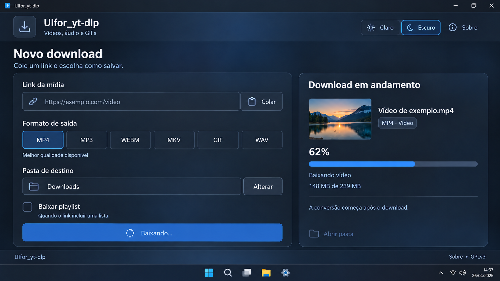
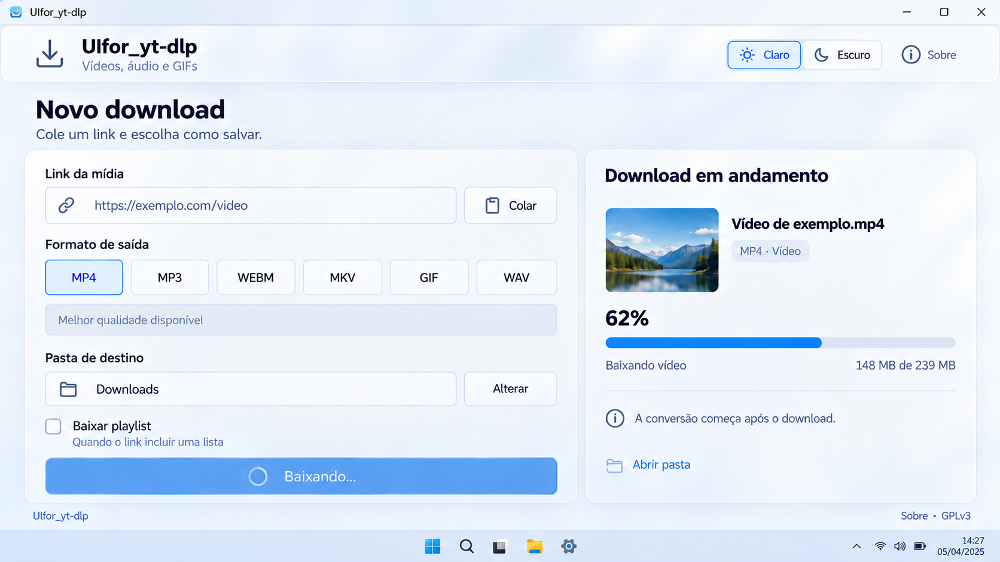
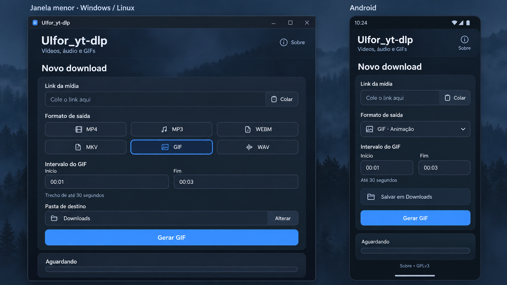

# Projeto da nova UI — revisão 03

Projeto visual solicitado em 2026-10-04, após o registro da base v3. O mantenedor escolheu **os dois temas, claro e escuro, com alternância no app**, esclareceu a maximização normal e autorizou a implementação. Windows/Linux e a adaptação Android estão implementados; os conceitos abaixo preservam a referência usada.

Capturas reais do desktop: [escuro](../images/ui-desktop-escuro.png), [claro](../images/ui-desktop-claro.png) e [compacto/GIF](../images/ui-desktop-compacto.png). Consulte [Validação](../VALIDATION.md) para distinguir os testes realizados das conferências gráficas Linux/Android ainda pendentes. As capturas mostram a área interna Qt; a moldura segue o sistema.

Clarificação do mantenedor: a janela deve **maximizar normalmente**, ocupando a área útil da tela e preservando a barra de tarefas/painéis do sistema. A imagem da mídia representará a thumbnail original da fonte quando disponível.

## Nome e linguagem

**Nome implementado: UIfor_yt-dlp**, acompanhando o nome do repositório. O título descreve uma interface para o backend; outros sites ainda são objetivo futuro.

- Linha descritiva: **Vídeos, áudio e GIFs**.
- Tela principal: **Novo download**.
- Campo de entrada: **Link da mídia**, com ajuda **Cole o link aqui**.
- Ação: **Baixar vídeo**, **Extrair áudio** ou **Gerar GIF**, conforme o formato.
- Nome de janela, título visual e futura identificação de distribuição devem acompanhar a marca escolhida. Mudanças de package/applicationId, assinatura e migração de pastas exigem tratamento próprio; esta proposta não altera essas identidades.

## Direções visuais

### A — Vidro escuro

Grafite e azul, superfícies com aparência de vidro fosco, bordas discretas e boa separação entre formulário e andamento. A cor azul destaca seleção, foco e ação principal.

### B — Vidro claro

Mesma organização em uma aparência branca/perolada, com texto escuro e azul nas ações. Alternativa de tema para quem prefere superfícies claras.

### C — Adaptação da opção escura

Mostra os blocos empilhados em uma janela menor e no celular, além dos campos condicionais de GIF. Foi produzida antes da escolha dos dois temas: o seletor de tema será adaptado ao cabeçalho compacto na implementação. O fundo de paisagem é ilustrativo e não exige capturar o papel de parede do usuário.

As imagens foram produzidas pela ferramenta integrada image_gen. A skill awesome-design-md e a referência Apple do catálogo orientaram tipografia, espaçamento e vidro fosco; é uma adaptação para aplicativo nativo, sem vínculo com essa marca. Os [prompts completos](prompts.json) estão preservados.

**Dados, miniaturas, porcentagens e URLs das imagens são exemplos.** As imagens representam o projeto futuro, não comprovam uma implementação funcional nem suporte a novos sites. Esta especificação prevalece sobre pequenos detalhes variáveis das imagens.

As imagens A/B-v3 mostram a janela maximizada com barra de título e barra de tarefas ilustrativas do Windows. No Linux, a moldura e os painéis seguirão o gerenciador de janelas, mantendo a mesma organização do aplicativo. Versões anteriores foram preservadas como histórico e não são a referência vigente.

## O que a interface terá

| Área | Comportamento proposto |
| --- | --- |
| Cabeçalho | Nome neutro, descrição curta, seletor de tema e acesso a Sobre. Minimizar, maximizar/restaurar e fechar são controles nativos da janela. |
| Link | Campo amplo, botão Colar, validação clara e mensagens apropriadas à fonte. |
| Formatos | Preservar MP4, MP3, WEBM, MKV, GIF e WAV. Opções visíveis nas três plataformas; no celular, três botões por linha. |
| GIF | Exibir início/fim apenas quando GIF estiver selecionado. Preservar os formatos de tempo aceitos e limite de 30 segundos. |
| Destino desktop | Caminho legível, seleção de pasta e opção de abrir a pasta ao finalizar. |
| Destino Android | Informar salvamento em Downloads pelo fluxo MediaStore atual. A linha da imagem não é um seletor arbitrário de pasta. |
| Playlist | Escolha explícita quando a fonte oferecer uma lista; preservar contagem e andamento por item. |
| Ação principal | Texto coerente com o formato e estado ocupado visível, com prevenção de acionamento duplicado. |
| Andamento | Distinguir leitura da fonte, download e conversão. Exibir porcentagem apenas quando mensurável; na conversão, andamento indeterminado e texto claro. |
| Thumbnail | Miniatura original da mídia fornecida pela fonte, preservando a proporção; ícone genérico quando ausente ou indisponível. Não gerar uma nova imagem para representar o vídeo. |
| Resultado | Mensagem legível para sucesso ou erro, com recuperação dos controles e acesso ao arquivo/pasta quando disponível. |
| Sobre | GPLv3, autoria, dependências, versão e histórico transparente do desenvolvimento com IA. Não sugerir IA executando downloads. |

O exemplo de miniatura/nome/tamanho no painel de andamento é uma melhoria proposta de apresentação. A paisagem nas imagens é ilustrativa; no aplicativo, esse espaço mostrará a thumbnail original, quando fornecida pela fonte, inclusive ao extrair áudio ou GIF do vídeo. Em playlist, acompanhar a mídia atual quando houver dados disponíveis. Se a miniatura não carregar, o download continua com um ícone genérico. Usar os dados reais do backend e estado indeterminado quando necessário. O seletor de melhor qualidade é informativo: não adicionar um controle fictício de resolução.

## Janela e maximização normal

- **Windows e Linux:** remover a trava futura de tamanho fixo; permitir redimensionar, maximizar e restaurar pelos controles normais do sistema.
- Na maximização, ocupar a **área útil disponível**, respeitando barra de tarefas, painéis e áreas reservadas pelo gerenciador de janelas. Não ocultar esses elementos nem cobri-los com o app.
- Preservar a barra de título nativa com minimizar, maximizar/restaurar e fechar. Não exigir uma moldura customizada para reproduzir exatamente as imagens.
- **Sem modo imersivo de tela inteira**, sem botão de tela inteira e sem atalhos F11/Esc para esse fim. A preferência anterior de fullscreen foi substituída por esta clarificação do usuário.
- Proposta: primeira abertura **maximizada**. Depois, restaurar o último estado/tamanho escolhido pelo usuário; ao restaurar para janela normal, usar tamanho confortável próximo de 1180 × 780, limitado à área útil do monitor.
- Tamanho mínimo preliminar: 720 × 540, com rolagem vertical quando necessário.
- Em largura útil de cerca de 1000 px ou mais, formulário à esquerda e andamento à direita. Abaixo disso, empilhar os dois blocos.
- Em monitores largos, o fundo ocupa toda a janela e o conteúdo usa largura confortável máxima de aproximadamente 1560 px. Controles não crescem indefinidamente.
- Desktop estreito usa formatos em duas linhas quando necessário; não introduzir rolagem horizontal para os controles principais.
- **Android:** coluna única, alvos de toque de pelo menos 48 dp, respeito às áreas do sistema e ao teclado. Manter as operações existentes, adaptando a apresentação.

## Aparência e interação

### Alternância escolhida

- Disponibilizar **Claro / Escuro** dentro do aplicativo nas três plataformas, sem reiniciar o app.
- Salvar a preferência local e restaurá-la na próxima abertura; primeira abertura proposta em tema escuro.
- A mudança de tema deve preservar link, pasta, formato, intervalo e andamento, inclusive durante um download.
- Desktop amplo usa os dois segmentos no cabeçalho, como nas imagens revisadas. Em janela estreita e Android, usar um controle compacto **Tema** ou linha adicional que permita a mesma escolha sem reduzir os alvos de toque.
- Aplicar o tema aos campos, painel de andamento, estados de foco/erro e diálogos próprios; barras e seletores nativos respeitam as possibilidades do sistema.
- A imagem C documenta a composição estreita e o GIF; o cabeçalho final também terá a escolha de tema.

| Elemento | Direção |
| --- | --- |
| Fundo escuro | Grafite/navy próximo de #10151F, com luz azul/cinza discreta. |
| Superfícies escuras | Próximas de #1C2533, opacidade alta para leitura. |
| Ação escura | Azul próximo de #4D9CFF. |
| Fundo claro | Branco/perolado próximo de #F4F6FA. |
| Ação clara | Azul próximo de #0066CC. |
| Tipografia | Fonte de sistema em cada plataforma; hierarquia por tamanho/peso, sem depender da instalação de SF Pro. |
| Espaçamento | Ritmo de 8 px; respiro de 16–24 px entre grupos; margens ajustáveis conforme tela. |
| Controles | Aproximadamente 48 px no desktop e 48 dp no celular; rótulos persistentes. |
| Bordas | Finas, cantos de cerca de 16–18 px nos painéis e menores nos campos. |
| Foco | Contorno visível, navegação por teclado e seleção identificável além da cor. |
| Movimento | Transições curtas e discretas, sem atrasar operações ou distrair durante o download. |

**Vidro portátil:** priorizar superfícies e luz internas ao aplicativo. Blur real do desktop depende do sistema/compositor e será opcional, com aparência opaca equivalente. A funcionalidade e a leitura não devem depender desse efeito. Não adicionar dependência gráfica pesada apenas para o vidro.

## Estados a desenhar na implementação

1. Inicial: campo vazio, formato selecionado, destino claro, estado Aguardando.
2. Validação: erro junto ao campo afetado, mantendo o conteúdo digitado.
3. Leitura da fonte/playlist: indicação de trabalho antes de obter tamanho total.
4. Download: porcentagem/dados reais quando disponíveis; controles relevantes indisponíveis durante a operação.
5. Conversão: texto específico ao formato e andamento indeterminado quando não houver medição.
6. Sucesso: resultado claro e Abrir pasta/arquivo habilitado.
7. Falha: explicação compreensível e controles recuperados para tentar novamente.

Fila, histórico, pausa, cancelamento e novos seletores de qualidade não fazem parte desta primeira proposta. Suporte a outras fontes seguirá implementação e testes próprios; a marca neutra não equivale a suporte já entregue.

## Estado após implementar

A revisão 04 adiciona o [fundo com a thumbnail](FUNDO_THUMBNAIL.md), já implementado nos dois temas e três fontes. Essa especificação complementa as imagens conceituais anteriores com capturas reais e comportamento de fallback.

1. Layout, marca, temas, janela desktop e thumbnail opcional implementados. Identidade/assinatura Android e caminhos de saída/instalação existentes preservados.
2. Desktop conferido no Windows: capturas nativas, seis formatos reais, troca de tema durante download público e regressões para os dois fontes. Escalas Qt 100/125/150/200% exercitadas neste monitor; mínimo reduzido conforme área útil em escala alta.
3. APK debug compilado e inspecionado; validação visual/funcional em celular e Linux gráfico pendente. Conferir teclado, rotação, leitores de tela e temas no aparelho.
4. Após testar e registrar esta revisão, ampliar as fontes do yt-dlp e validar sites escolhidos, com textos e erros apropriados.

Tamanhos de referência para a futura validação desktop: 720 × 540, 1024 × 768, 1366 × 768, 1920 × 1080 e 2560 × 1440; escalas de 100%, 125%, 150% e 200%. No Android, conferir coluna única, teclado e telas de cerca de 360–430 dp de largura. Esses são alvos de validação, não resultados já obtidos.
